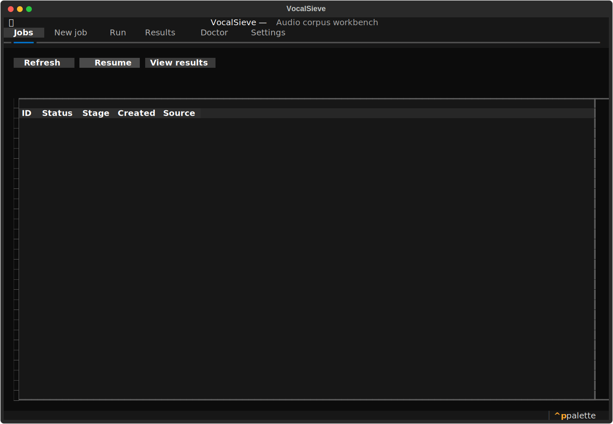
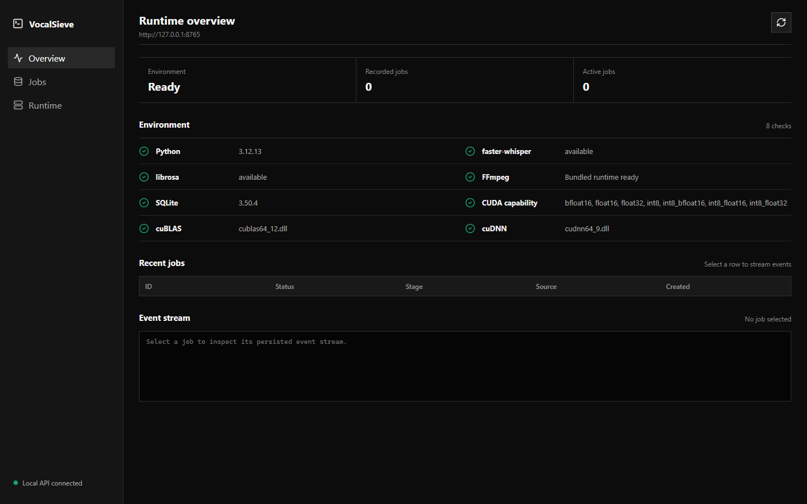

# VocalSieve

[简体中文](README.zh-CN.md)

[](https://github.com/cheese-sansan/VocalSieve/actions/workflows/ci.yml)
[](https://github.com/cheese-sansan/VocalSieve/actions/workflows/security.yml)
[](https://github.com/cheese-sansan/VocalSieve/releases)
[](LICENSE)

> Turn raw voice folders into reviewable, reproducible speech datasets — locally.

VocalSieve screens, transcribes, ranks, reviews, and exports speech audio without
uploading it. Point it at a source folder, keep that folder read-only, and get a
curated dataset with traceable decisions instead of an opaque pile of copied files.

## From folder to dataset

1. **Scan safely.** Discover supported audio while leaving the source tree untouched.
2. **Measure first.** Reject unusable files with duration, energy, and spectral rules.
3. **Transcribe locally.** Run `faster-whisper` only on eligible audio and record backend fallbacks.
4. **Rank and review.** Select the strongest candidates, then manually include or exclude edge cases.
5. **Export reproducibly.** Preserve relative paths and write CSV, JSON, summary, events, and job state.

Every run is stored in SQLite with its configuration, progress, transcripts,
rejection reasons, review decisions, and resume state. The final export is therefore
inspectable, repeatable, and safe to revise.



The React/Vite workspace uses the same versioned local API for job creation,
cancel/resume, results, reports, review, events, and re-export. It is an experimental
development preview, not part of the Windows portable support promise.



## Why local-first

- Source audio and transcripts stay on the machine you control.
- Native API access is restricted to `127.0.0.1` and protected by a session token.
- Source and output paths cannot overlap; exports never modify the source corpus.
- Model weights are downloaded on first use and are not committed or baked into images.
- CPU, CUDA, and fallback details are recorded in diagnostics, events, and reports.

## Project status

The latest published prerelease is
[`v0.9.0-rc.1`](https://github.com/cheese-sansan/VocalSieve/releases/tag/v0.9.0-rc.1).
The source tree is preparing `0.9.0-rc.2`, but rc.2 has not been published and has
no official download yet. CI artifacts and locally built archives are not releases.

| Platform | Supported path |
| --- | --- |
| Windows 10/11 | Native CLI and bilingual TUI; CPU ready, CUDA 12 + cuDNN 9 documented |
| Linux | CPU and NVIDIA GPU containers |
| macOS | Experimental; outside the release gate |

Python 3.11 or 3.12 is required for source installs. Native use requires FFmpeg on
`PATH`; see [FFMPEG.md](docs/FFMPEG.md) and [CUDA.md](docs/CUDA.md).

## Quick start

### Windows portable

Use only assets attached to a visible GitHub Release. Download
`VocalSieve-Windows-x64.zip`, verify `SHA256SUMS`, extract to a new directory, and
launch `VocalSieve.exe` or `Start-VocalSieve.cmd`. The portable archive needs neither
Python nor uv, and supports the CLI, TUI, and `doctor` command.

Prerelease archives use a disclosed self-signed project certificate rather than a
commercially trusted certificate. SBOM, certificate fingerprint, checksums, and
FFmpeg GPL source provenance are published beside the archive.

### Developer install with uv

```powershell
git clone https://github.com/cheese-sansan/VocalSieve.git
cd VocalSieve
uv sync --extra tui
uv run vocalsieve doctor
uv run vocalsieve
```

### Developer install with pip

```powershell
py -3.12 -m venv .venv
.venv\Scripts\python -m pip install -e ".[tui]"
.venv\Scripts\vocalsieve doctor
.venv\Scripts\vocalsieve
```

Install `.[api]` for the local HTTP API or `.[tui,api,dev]` for development.

## Screen, review, and export

```powershell
vocalsieve run "E:\data\raw" "E:\data\screened" --model small --device auto --top-n 1200
vocalsieve jobs
vocalsieve resume JOB_ID
vocalsieve report JOB_ID
vocalsieve export JOB_ID
```

`top-n` is a maximum after all rules run, not a guaranteed output count. Selected
audio is written under `OUTPUT/final_selected/`. The output root also receives a
row-oriented CSV report, JSON report, and schema v2 aggregate summary.

After a job completes, the TUI, SDK, or local API can mark any result as manually
included, manually excluded, or automatic. The original pipeline status remains
unchanged, every review is audited, and re-export reconciles only files previously
managed by that job.

## Interfaces

- **TUI:** run `vocalsieve`; the first launch asks for English or Simplified Chinese.
- **CLI:** use `run`, `jobs`, `resume`, `export`, `report`, `doctor`, and `serve` for automation.
- **Python SDK:** import the versioned public surface from `vocalsieve`.
- **Local API:** start `vocalsieve serve`; jobs, paths, results, transcripts, and events require the printed token.
- **Experimental Web:** run the Vite client against the local API; it consumes generated OpenAPI types only.

```python
from vocalsieve import PipelineConfig, VocalSieveClient

config = PipelineConfig(
    source_dir=r"E:\data\raw",
    output_dir=r"E:\data\screened",
    device="auto",
    top_n=100,
)

with VocalSieveClient("vocalsieve.db") as client:
    job = client.create_job(config)
    completed = client.run_job(job.id)
    results = client.query_results(completed.id)
```

The default runtime permits two active jobs and at most one CUDA job. Processes
sharing a SQLite database coordinate those limits and reject conflicting paths or
exhausted capacity instead of silently queueing work.

### Experimental Web workspace

```powershell
uv sync --extra api
uv run vocalsieve serve

# In another terminal, use the token printed above:
$env:VITE_VOCALSIEVE_TOKEN = "the-local-session-token"
npm --prefix web ci
npm --prefix web run dev
```

Open `http://127.0.0.1:5173`. The browser is allowed only from the two documented
localhost origins and does not receive direct filesystem access.

## Containers

```powershell
$env:VOCALSIEVE_SESSION_TOKEN = "replace-with-a-long-random-value"
docker compose --profile cpu up --build
```

Use `--profile gpu` with NVIDIA Container Toolkit. The service binds to
`127.0.0.1:8765`; `/data/input` is read-only, while output, state, and model cache
use separate mounts. See [DOCKER.md](docs/DOCKER.md).

## Development

```powershell
uv sync --all-extras
uv run pre-commit run --all-files
uv run pyright
uv run pytest --cov=vocalsieve
uv run python scripts/export_openapi.py --check
npm --prefix web ci
npm --prefix web run build
```

The private-corpus procedure and publication boundary are documented in
[BENCHMARK.md](docs/BENCHMARK.md). This README does not treat a local benchmark as
a release gate or public release.

## Stewardship and development assistance

Project direction, decisions, review, and releases are maintained by Hueter
([@cheese-sansan](https://github.com/cheese-sansan)). Development is assisted by
ChatGPT Codex. All AI-assisted changes are reviewed and accepted by the maintainer.

Dependency updates are implemented on maintainer/Codex branches after the weekly
security workflow, a GitHub vulnerability alert, or release preparation identifies
a need. Automated Dependabot update PRs are intentionally disabled.

## Documentation

- [Filtering and rejection reasons](docs/FILTERING.md)
- [Local API and security](docs/API.md)
- [CUDA setup](docs/CUDA.md)
- [FFmpeg setup and provenance](docs/FFMPEG.md)
- [Container operation](docs/DOCKER.md)
- [Dependency policy](docs/DEPENDENCIES.md)
- [Release process](docs/RELEASE.md)
- [Security policy](SECURITY.md)
- [Contributing](CONTRIBUTING.md)

VocalSieve is released under the [MIT License](LICENSE). Third-party components
remain covered by their own licenses in [THIRD_PARTY_NOTICES.md](THIRD_PARTY_NOTICES.md).
